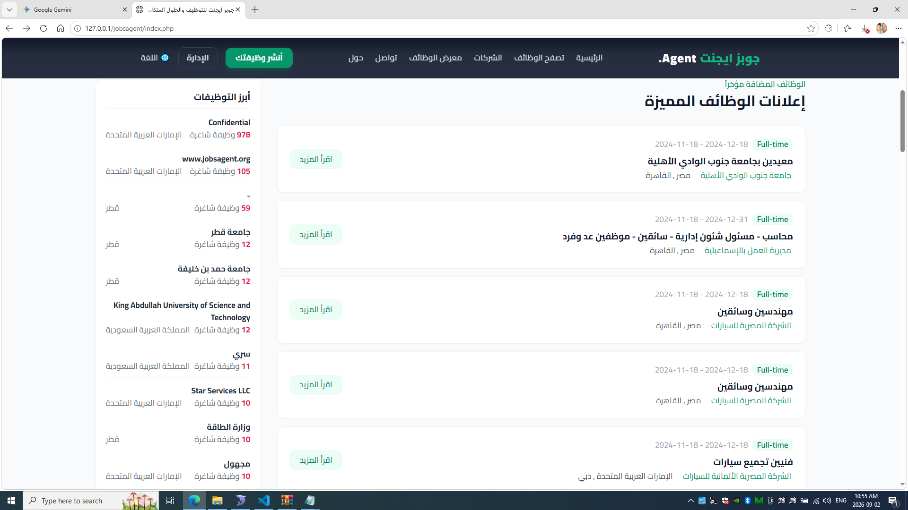
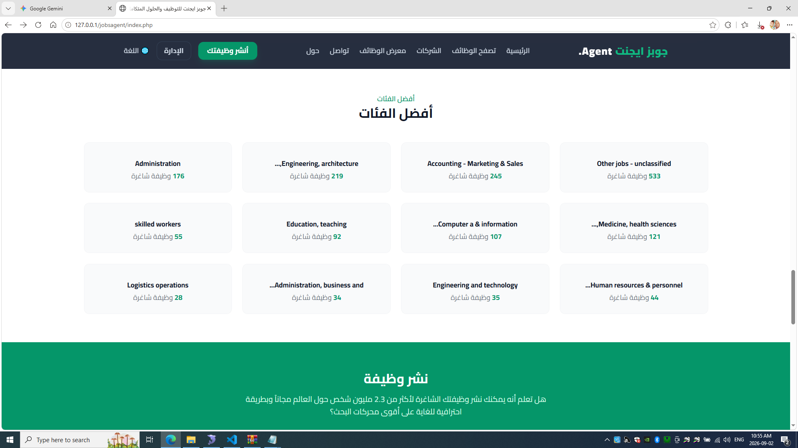
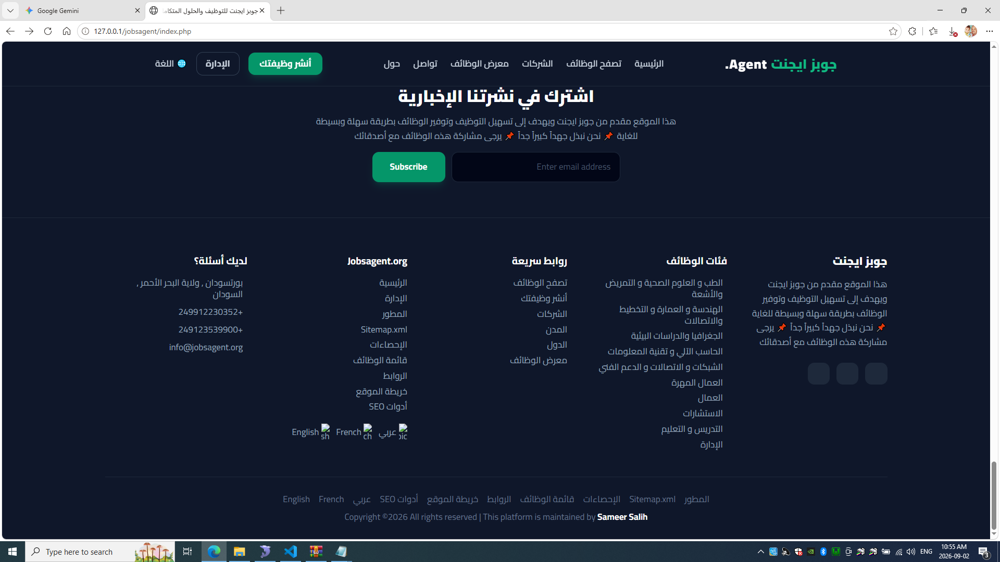
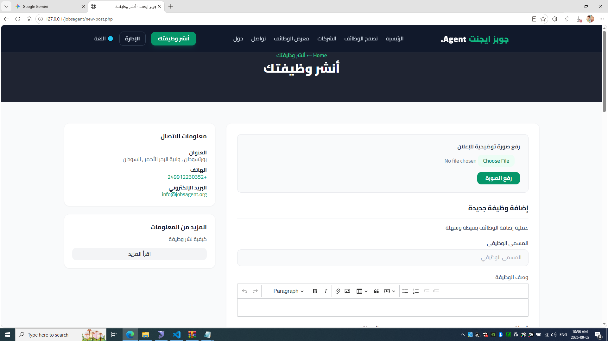
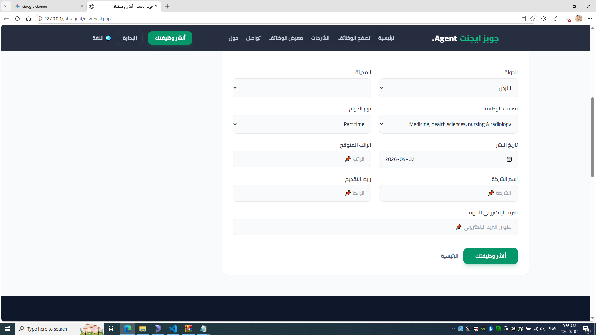
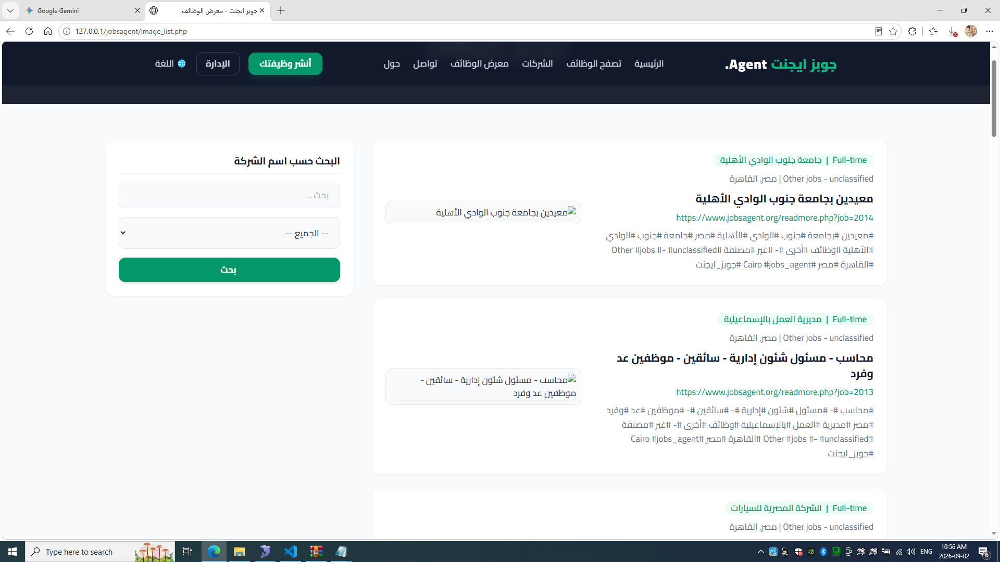
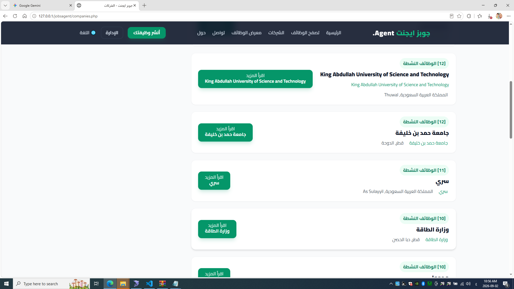
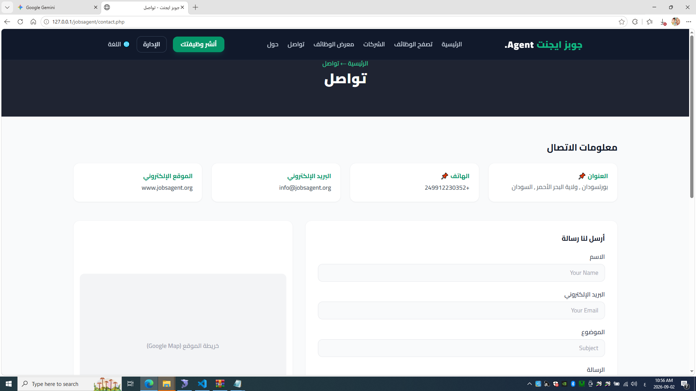
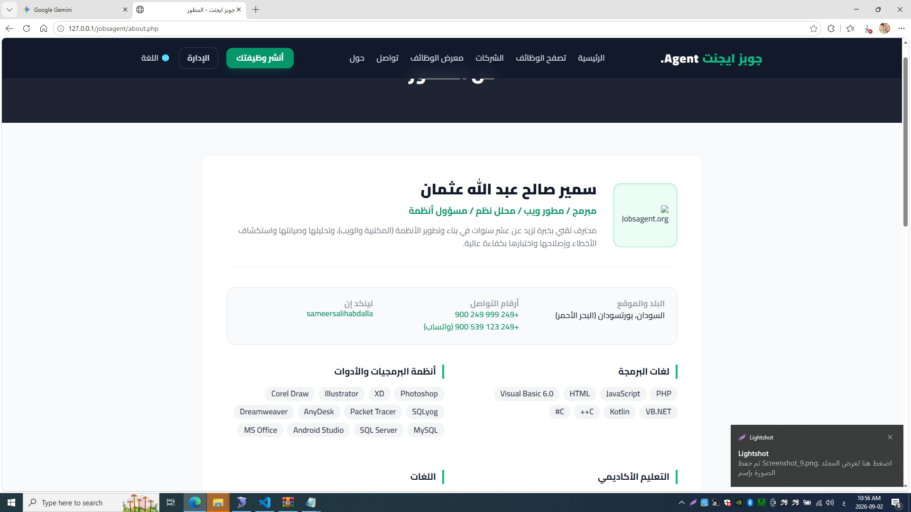
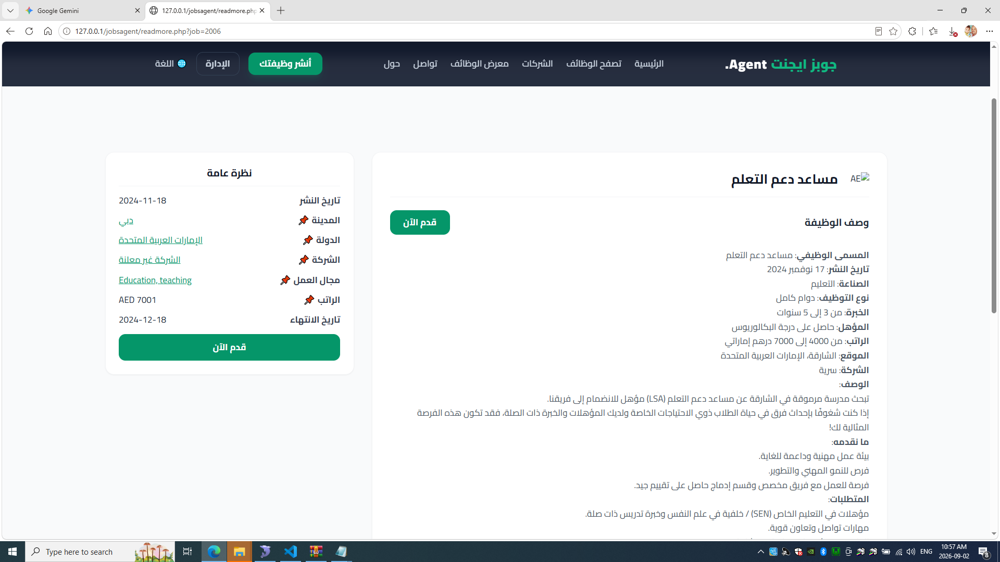

# 🌐 JobsAgent - جويز ايجنت للتوظيف والحلول المتكاملة

[English Version](#-english-version) | [النسخة العربية](#-النسخة-العربية)

---

## 🇸🇦 النسخة العربية

منصة إلكترونية متقدمة تهدف إلى تسهيل عملية التوظيف وربط الباحثين عن العمل بأصحاب العمل والشركات في أكثر من **70 دولة** وبأكثر من **27 لغة**، لتوفير آلاف الوظائف المختلفة في مكان واحد.

### 📸 معاينة واجهات المشروع (Screenshots)

| وصف الواجهة | معاينة الصورة |
| :--- | :--- |
| **الصفحة الرئيسية (1):** عرض إحصائيات المنصة ومحرك البحث السريع. |  |
| **إعلانات الوظائف المميزة:** قائمة بأحدث الوظائف المضافة وتفاصيلها. |  |
| **أفضل الفئات:** عرض تصنيفات الوظائف المختلفة (إدارة، هندسة، تقنية). |  |
| **تذييل الصفحة (Footer):** الروابط السريعة، خريطة الموقع، والنشرة البريدية. |  |
| **صفحة أنشر وظيفتك (1):** نموذج إضافة وظيفة جديدة ورفع صورة توضيحية. |  |
| **صفحة أنشر وظيفتك (2):** استكمال حقول الدولة، المدينة، الراتب، ورابط التقديم. |  |
| **معرض الوظائف:** استعراض الوظائف مع الوسوم والبحث حسب اسم الشركة. |  |
| **صفحة الشركات:** قائمة بالشركات النشطة مع عدد الوظائف المتاحة. |  |
| **صفحة التواصل:** معلومات الاتصال الكاملة ونموذج المراسلة وخريطة الموقع. |  |
| **صفحة المطور:** نبذة عن المطور (سمير صالح) والمهارات والأدوات المستخدمة. |  |
| **تفاصيل الوظيفة:** عرض تفصيلي للمتطلبات والراتب والوصف الوظيفي. |  |
| **قائمة تبديل اللغات:** دعم تعدد اللغات (عربي، English، French). |  |

---

## 🇬🇧 English Version

An advanced recruitment and integrated solutions platform designed to connect job seekers with employers across more than **70 countries** and in over **27 languages**.

### 📸 Project UI Screenshots

| Interface Description | Preview |
| :--- | :--- |
| **Home Page (1):** Platform statistics and quick search bar. |  |
| **Featured Job Ads:** List of recently added jobs and details. |  |
| **Top Categories:** Displaying various job sectors. |  |
| **Footer Section:** Quick links, sitemap, and newsletter. |  |
| **Post a Job (1):** New job submission form and image upload. |  |
| **Post a Job (2):** Country, city, salary, and application link fields. |  |
| **Jobs Directory:** Browsing jobs with tags and company search. |  |
| **Companies Page:** Active companies with available job counts. |  |
| **Contact Page:** Full contact info, form, and map integration. |  |
| **Developer Profile:** About developer (Sameer Salih) and tech stack. |  |
| **Job Details Page:** Detailed vacancy view and requirements. |  |
| **Language Switcher:** Multi-language support dropdown. |  |

---
